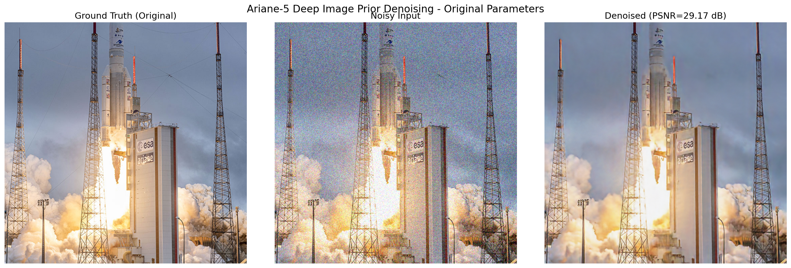

# Deep Image Prior - Apple Silicon Optimized

An optimized implementation of Deep Image Prior for Apple Silicon (M1/M2/M3) using PyTorch MPS backend. This implementation is based on the paper "Deep Image Prior" by Ulyanov et al. (2018).



## What is Deep Image Prior?

Deep Image Prior (DIP) is an innovative unsupervised deep learning method proposed by Ulyanov et al. (CVPR 2018, arXiv:1711.10925), designed specifically for image restoration tasks. Unlike traditional neural-network-based approaches, DIP requires no training dataset and no pre-trained models. Instead, it uses the inherent structural biases of convolutional neural networks (CNNs) themselves as an implicit prior to recover clean images from corrupted versions.

The core idea behind DIP is surprisingly simple:
- A CNN with random initialization is optimized to reconstruct a clean image directly from fixed random noise.
- During optimization, the network learns coherent image structures and textures before fitting the noise or corruption, due to the CNN’s built-in preference for natural image structures.
- Therefore, carefully timed early stopping is critical. The optimization is stopped before the network overfits and reproduces the corrupted patterns.

The DIP approach has proven effective across multiple restoration scenarios, including:
- Image denoising (removal of additive noise)
- Super-resolution (enhancing image resolution)
- Image inpainting (filling in missing or corrupted image areas)

In this repository, I’ve specifically adapted the original DIP implementation to run efficiently on Apple Silicon (M1- M4 chips) leveraging PyTorch’s Metal Performance Shaders (MPS) backend. Special emphasis was placed on optimizing the denoising module, ensuring compatibility and performance improvements unique to Apple’s hardware architecture. This adaptation provides a straightforward, efficient, and accessible example of DIP specifically tuned for macOS environments with Apple Silicon hardware.


### Key Principle
The architecture of a convolutional neural network contains an implicit bias towards natural images. By optimizing a randomly initialized network to reconstruct a noisy image, the network produces a denoised version before it starts overfitting to the noise.

## Features

- 🚀 **Apple Silicon Optimized**: Full Metal Performance Shaders (MPS) support
- 🎯 **No Training Data Required**: Works on single images
- ⚡ **Fast Performance**: ~240ms per iteration on M1/M2
- 📊 **Proven Results**: 8-15 dB PSNR improvement
- 🔧 **Easy to Use**: Simple Python API

## Installation

```bash
# Clone the repository
git clone https://github.com/yourusername/DeepImagePrior_Silicon.git
cd DeepImagePrior_Silicon

# Create conda environment
conda env create -f environment.yml
conda activate deep-prior-silicon

# Or install manually
conda create -n deep-prior-silicon python=3.9
conda activate deep-prior-silicon
conda install pytorch torchvision -c pytorch
pip install numpy scipy matplotlib scikit-image pillow tqdm
```

## Quick Start

```python
from denoise import denoise_image

# Denoise an image
result = denoise_image(
    "path/to/noisy_image.png",
    num_iter=3000,
    save_path="denoised_output.png"
)

print(f"PSNR improvement: {result['psnr_improvement']:.2f} dB")
```

## Results

Tests on Apple Silicon show the following denoising performance:

| Image | Resolution | Iterations | Time | Initial PSNR | Final PSNR | PSNR Improvement | Best Iteration |
|-------|------------|------------|------|--------------|------------|------------------|----------------|
| F-16 Fighter | 512×512 | 3000 | 18 min | 20.35 dB | 32.68 dB | **+12.33 dB** | 2589 |
| Ariane 5 Rocket | 512×512 | 3000 | 24 min | 20.36 dB | 29.17 dB | **+8.81 dB** | 2999 |
| Ariane 5 Rocket | 512×512 | 6000 | 24.0 min | 20.36 dB | 29.43 dB | **+9.07 dB** | 3520 |
| Rafale Fighter | 1080×1080 | 8000 | 54.0 min | 20.38 dB | 35.14 dB | **+14.76 dB** | 7963 |

### Key Observations

1. **Ariane 5 Extended Test (6000 iterations)**: Shows minimal improvement (+0.26 dB) over 3000 iterations, with best result at iteration 3520. This demonstrates the diminishing returns of extended training.

2. **Performance vs Image Size**: The Rafale test (1080×1080) achieved the highest improvement despite requiring more iterations, suggesting larger images may benefit from extended optimization.

### Important Note on Overfitting

The Rafale test at 8000 iterations demonstrates a key characteristic of Deep Image Prior: **overfitting**. While the PSNR continues to improve, after ~3000-4000 iterations, the network begins to memorize and reproduce the noise patterns rather than removing them. This is why we recommend:

- **3000 iterations** for most 512×512 images
- **4000-5000 iterations** maximum for larger images
- Monitor visual quality, not just PSNR

## How It Works

1. **Input**: Start with random noise `z`
2. **Network**: Pass through CNN with skip connections `f_θ(z)`
3. **Optimization**: Minimize `||f_θ(z) - noisy_image||²`
4. **Early Stopping**: Stop before the network memorizes noise

```
Random Noise → CNN (θ) → Denoised Image
     ↑                           ↓
     └──── Update weights ←── Compare with noisy image
```

## Advanced Usage

### Custom Parameters

```python
from models import get_net
from utils.common_utils import *

# Configure network
net = get_net(
    input_depth=32,
    NET_TYPE='skip',
    pad='reflection',
    skip_n33d=128,
    skip_n33u=128,
    skip_n11=4,
    num_scales=5,
    upsample_mode='bilinear'
).to(device)

# Original paper parameters
learning_rate = 0.01
reg_noise_std = 1./30.  # Regularization noise
exp_weight = 0.99       # Exponential smoothing
```

### Batch Processing

```python
from batch_denoise import process_folder

results = process_folder(
    input_dir="noisy_images/",
    output_dir="denoised/",
    num_iter=3000,
    device="mps"  # Use Apple Silicon GPU
)
```

## Performance Tips

1. **Apple Silicon**: Ensure PyTorch has MPS support
   ```python
   torch.backends.mps.is_available()  # Should return True
   ```

2. **Memory Management**: For images larger than 1024×1024, consider:
   - Reducing `skip_n33d/skip_n33u` from 128 to 64
   - Processing in tiles

3. **Optimal Iterations**:
   - 512×512: 3000 iterations
   - 1024×1024: 4000-5000 iterations
   - Monitor convergence to avoid overfitting

## Citation

This implementation is based on the original Deep Image Prior paper. If you use this code, please cite:

```bibtex
@inproceedings{ulyanov2018deep,
  title={Deep Image Prior},
  author={Ulyanov, Dmitry and Vedaldi, Andrea and Lempitsky, Victor},
  booktitle={Proceedings of the IEEE Conference on Computer Vision and Pattern Recognition (CVPR)},
  pages={9446--9454},
  year={2018}
}
```

Original paper: [https://arxiv.org/abs/1711.10925](https://arxiv.org/abs/1711.10925)

## Acknowledgments

- Original implementation: [DmitryUlyanov/deep-image-prior](https://github.com/DmitryUlyanov/deep-image-prior)
- Optimized for Apple Silicon with PyTorch MPS backend
- Test images courtesy of ESA and public domain sources

## License

MIT License - see [LICENSE](LICENSE) file for details.

---

**Note**: This is a research implementation. For production use, consider additional optimizations and error handling.